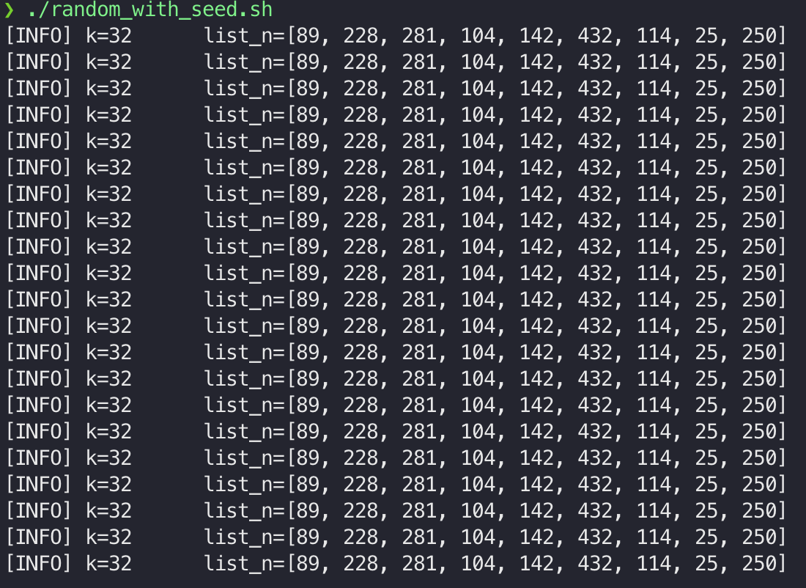

## Discussion

1. Discuss the method used for generating random numbers and its impact on the results. Can we generate the same random number multiple times? If so, please add that implementation.

    - In the `experiment/task_1_normal.py` program, I used **[`random` Python library](https://docs.python.org/3/library/random.html)** to create a list contain `n * 2` integer numbers which one have `n` bits.
    - Following by [library docs](https://docs.python.org/3/library/random.html#:~:text=This%20module%20implements%20pseudo%2Drandom%20number%20generators%20for%20various%20distributions.), this library implemented pseudo-random number generator for various distributions. So, with each run of the program, we will get different random `list_n` array and different `k` number, ***which will lead to varying results***.
    -  For the question *"Can we generate the same random number multiple time?"*, the answer is *"Yes"*.
       -  I addressed that problem by employing a function from `random` library called `random.seed()`.
       -  The `random.seed()` function is used to generalize the random number generator. By seeding the generator, the program can ensure that I get the same sequence of random numbers each time I run the program.
       -  I implemented it in `experiment/task_1_seed.py` file, ran it multiple times with shell script and I got results describe in the image below.

            

        - I set the `random.seed(42)` and ran it 20 times, as we can see each run have the same result.

2. Analyze the average number of trials needed to solve Task 1.a and 1.b. Try to find the optimal solution with the smallest number of steps required. Discuss the complexities involved in the operations.

    2.1. Analyze the average number of trials needed 

      - For **Task 1.a**, because of random method is pseudo-random and it does not follow any distributions, so I think it has time complexity is `linear`, base-on the random values, so the time complexity is `O(n)`
      - For **Task 1.b**, I always have `2*n` steps because the program need to iterate through all the elements of the list to find the number that smaller that `k`.

    2.2. Optimal solutions proposal

      - After generated the list containt `2*n` random numbers, I had sorted this list then applied binary search to determine that `k` exist in the given list. For the **Binary Search** algorithm, it has time complexity `O(log n)` and `O(1)` Auxiliary Space.
      - In the **Task 1.b**, I also sort the list then find the array's index which is the first element that greater than `k`, then I return the sub-array contain all element from `0` to `index` like `list_n[:index]`.   - By approaching this method, I also used **Binary Search** to find the index of first element number greater than `k`.   - The solution also has `O(log n)` of time complexity and `O(1)` Auxiliary Space.
      - I implemented solutions in `experiment/task_1_optimal.py` file.

3. Which problems in Task 1 can be improved using quantum computing? Why?

- I have spent a lot of time on [IBM Quantum Learning](https://learning.quantum.ibm.com/course/fundamentals-of-quantum-algorithms) and I found [Grover's algorithm](https://learning.quantum.ibm.com/course/fundamentals-of-quantum-algorithms/grovers-algorithm) can improve the search problem *quadratic* faster than classical algorithms.
-  

## Bonus tasks

### Bonus 1

### Bonus 2

- To package the programe and deploy it anywhere, I will implement:
  - Using FastAPI to expose program as an API endpoint for serving user's requests.
  - Packaging the program as a Docker image by using `Dockerfile`.
  - Deploy the Docker image run as a container on local machine or on cloud.
    - I additionally deploy the application on Kubernetes cluster.
- All deployments are stored at `deploy` folder.