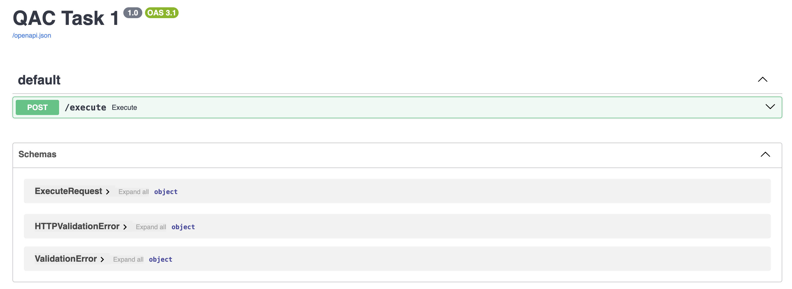
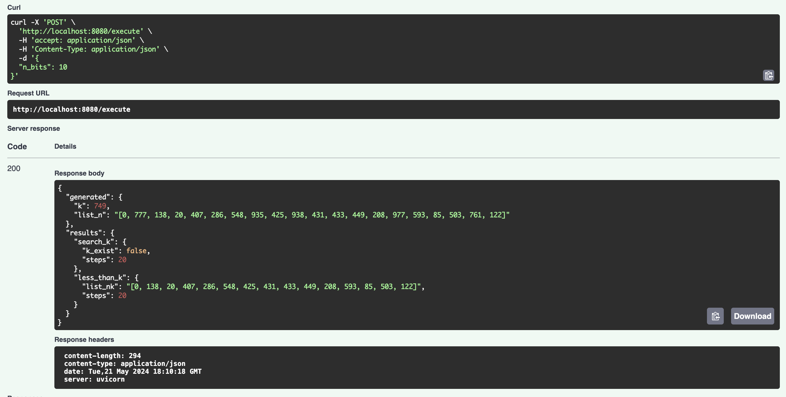

- Step 1: Build the docker image
  
    ```bash
    docker build -t qac-screen-test -f Dockerfile .
    ```

- Step 2: Run the Docker container locally

    ```bash
    docker run -dit -p 8080:8080 --name qac-screen-test-api qac-screen-test
    ```

- Step 3: Access to the `localhost:8080/docs` on the browser and you will see

    

- Step 4: Post request and get response

    